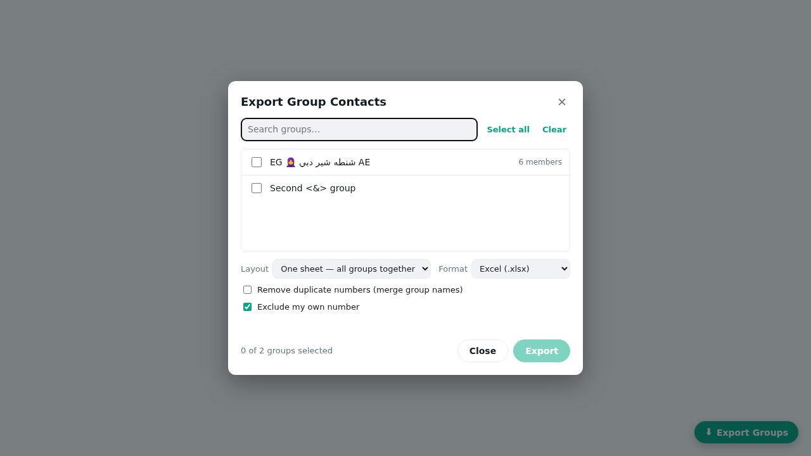

<div align="center">


# WhatsApp Group Contacts Exporter

**Export the members of your WhatsApp groups to Excel with one click, straight from WhatsApp Web in Chrome.**

Phone number · Country · Public name · Saved name · Group · Contact & Business flags


</div>

---

## ✨ Features

- **One-click export**: a green **Export Groups** button appears inside WhatsApp Web.
- **Pick any groups**: search, select all or clear, and see member counts.
- **Excel (.xlsx) or CSV**: Arabic and emoji names stay intact.
- **Two layouts**: one combined sheet, or one sheet per group, plus a **Summary** sheet.
- **Remove duplicates**: a number that appears in several groups is exported once, and its group names are merged (`Group A | Group B`).
- **Exclude your own number** (on by default).
- **Sorted the smart way**: saved contacts first, then everyone else alphabetically.
- **100% local**: nothing is uploaded, and there is no server, analytics or tracking. The file is built in your browser.
- **No dependencies**: it ships its own small XLSX writer.

## 📊 Output columns

| Column | Example | Source |
|---|---|---|
| Country Code | `966` | Derived from the phone number |
| Country | `Saudi Arabia` | Derived from the phone number |
| Phone Number | `+966506724188` | Group participant |
| Public Display Name | `M.N` | The name the person set in WhatsApp ("pushname") |
| Saved Name | `Maher` | The name in *your* phone contacts |
| Group Name | `Riyadh Tech Group` | Group subject |
| Is My Contact | `True` / `False` | Saved in your contacts? |
| Is Business | `True` / `False` | WhatsApp Business account? |

A sample file is included: [`docs/sample-output.xlsx`](docs/sample-output.xlsx).



---

## 🚀 Installation

The extension isn't on the Chrome Web Store, so you install it in *Developer mode*. It takes about a minute.

### Option A: download a release (easiest)

1. Go to the [**Releases**](https://github.com/CyberAlp0/whatsapp-group-contacts-exporter/releases) page and download `wa-group-exporter-x.y.z.zip`.
2. **Unzip** it into a folder you'll keep. Don't delete that folder later, or Chrome will remove the extension.
3. Continue with **Load into Chrome** below.

### Option B: clone the repository

```bash
git clone https://github.com/CyberAlp0/whatsapp-group-contacts-exporter.git
```

Or click **Code → Download ZIP** on GitHub and unzip it.

### Load into Chrome

1. Open `chrome://extensions` in the address bar.
2. Turn on **Developer mode** (the toggle at the top-right).
3. Click **Load unpacked**.
4. Select the folder that contains **`manifest.json`**.
5. *(Optional)* Click the 🧩 puzzle icon in the toolbar and **pin** the extension.

It also works in **Microsoft Edge** (`edge://extensions`), **Brave** (`brave://extensions`), **Opera** and other Chromium browsers running version **111 or newer**.

---

## 🧭 How to use

1. Open **[web.whatsapp.com](https://web.whatsapp.com)** and log in by scanning the QR code with your phone.
2. Wait until your chat list has fully loaded.
3. Click the green **⬇ Export Groups** button in the bottom-right corner.
4. Tick the groups you want. Use the search box to filter.
5. Choose the options:
   - **Layout**: *One sheet* (all groups together) or *One sheet per group*
   - **Format**: *Excel (.xlsx)* or *CSV*
   - **Remove duplicate numbers**
   - **Exclude my own number**
6. Click **Export**. The file downloads as `WhatsApp_Group_Contacts_YYYY-MM-DD_HH-mm.xlsx`.

> 💡 **Large exports:** the tool reads groups one by one with a short pause between them. Keep the tab open until the progress bar finishes.

---

## ❓ FAQ & troubleshooting

**The "Export Groups" button doesn't appear.**
Reload WhatsApp Web (`Ctrl+R`). Then check at `chrome://extensions` that the extension is enabled and shows no errors. If it still doesn't appear, open DevTools (`F12`) → **Console** and look for `[WA Group Exporter] loaded`.

**Some rows say `Hidden (privacy)`.**
WhatsApp now hides some members' phone numbers in certain groups (large groups, communities, or when a member uses the "hide phone number" privacy setting). The tool fills in the number whenever WhatsApp Web knows it, for example when the person is in your contacts or has messaged you. Otherwise only the name is exported. This is a WhatsApp privacy feature and cannot be bypassed.

**"Saved Name" is empty for many people.**
That column only has a value for people saved in *your* phone contacts. That is expected.

**A group shows 0 members or fails to load.**
Open that group once in WhatsApp Web so it syncs, then export again.

**Excel shows Arabic text wrongly in the CSV.**
Use the **.xlsx** format, or in Excel go to *Data → From Text/CSV* and choose **UTF-8**.

**It stopped working after a WhatsApp update.**
WhatsApp Web changes its internals from time to time. Open DevTools → Console, run `WAGX.diagnose()`, and [open an issue](https://github.com/CyberAlp0/whatsapp-group-contacts-exporter/issues) with the output.

---

## 🛠️ How it works (for developers)

```
manifest.json          Manifest V3: content script injected into web.whatsapp.com (MAIN world)
src/content.js         Reads WhatsApp Web's in-memory data, builds the UI, runs the export
src/xlsx-writer.js     Tiny dependency-free XLSX (Office Open XML) + ZIP writer
src/countries.js       Calling-code → country lookup (longest-prefix match)
src/styles.css         UI styles (light & dark theme aware)
popup/                 Toolbar popup with usage instructions
scripts/package.sh     Builds dist/wa-group-exporter-<version>.zip
.github/workflows/     Attaches the zip to a GitHub Release on every v* tag
```

- The content script runs in the page's **MAIN world**, so it can use WhatsApp Web's own module loader (`require('WAWebCollections')`). That gives it the `Chat`, `Contact` and `GroupMetadata` collections, the same data WhatsApp uses to draw the group info screen. For older WhatsApp builds there is a fallback to the legacy webpack chunk.
- Group participants come from `GroupMetadata`. If metadata isn't cached yet, it is fetched with `GroupMetadata.find()`.
- Members addressed by a privacy ID (`@lid`) are mapped back to a phone number through `participant.phoneNumber`, `contact.phoneNumber` or `WAWebApiContact.getPhoneNumber()` when WhatsApp exposes it.
- The UI is built with plain DOM APIs (no `innerHTML`), so it works with WhatsApp's Trusted Types CSP.
- **Permissions:** only `https://web.whatsapp.com/*`. There are no background scripts, no remote code and no network requests.

**DevTools helpers:** `WAGX.open()` opens the export window and `WAGX.diagnose()` prints a status table.

### Releasing a new version

```bash
# 1. bump "version" in manifest.json and add a CHANGELOG entry
git commit -am "Release v1.0.1"
git tag v1.0.1
git push && git push --tags      # GitHub Actions builds the zip and creates the Release
```

To build the zip locally, run `./scripts/package.sh`.

---

## ⚖️ Responsible use & disclaimer

- This project is **not affiliated with, endorsed by, or connected to WhatsApp or Meta**. "WhatsApp" is a trademark of its respective owner.
- The tool only reads data your own WhatsApp account can already see in groups you belong to.
- Automated extraction may be against [WhatsApp's Terms of Service](https://www.whatsapp.com/legal/terms-of-service). Use it at your own risk.
- Exported phone numbers are **personal data**. Handle them lawfully and follow your local privacy law (for example Saudi PDPL, EU GDPR or Egypt Law 151/2020). **Do not use this tool for spam or unsolicited bulk messaging.** Bulk messaging can get your WhatsApp number banned.

## 📄 License

[MIT](LICENSE)
